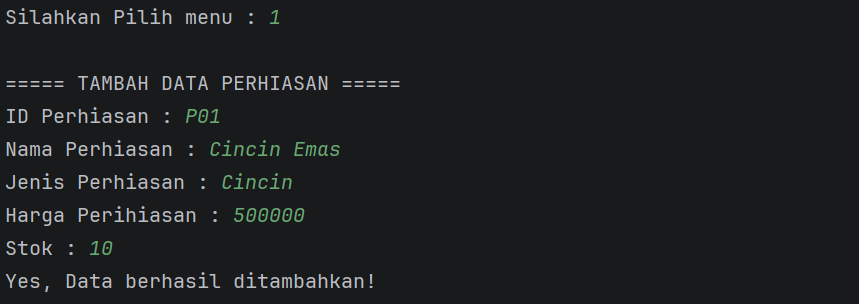
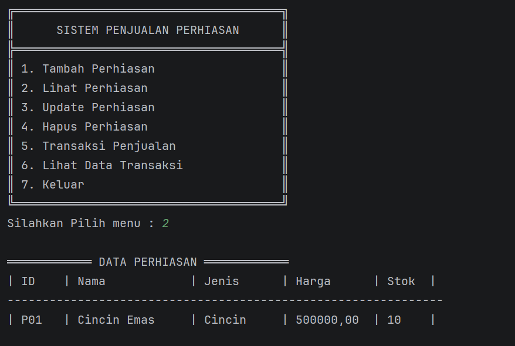
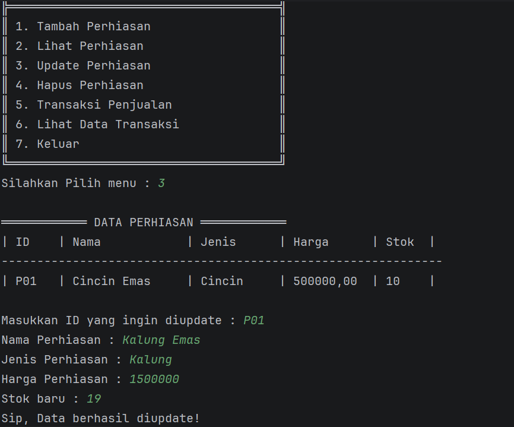
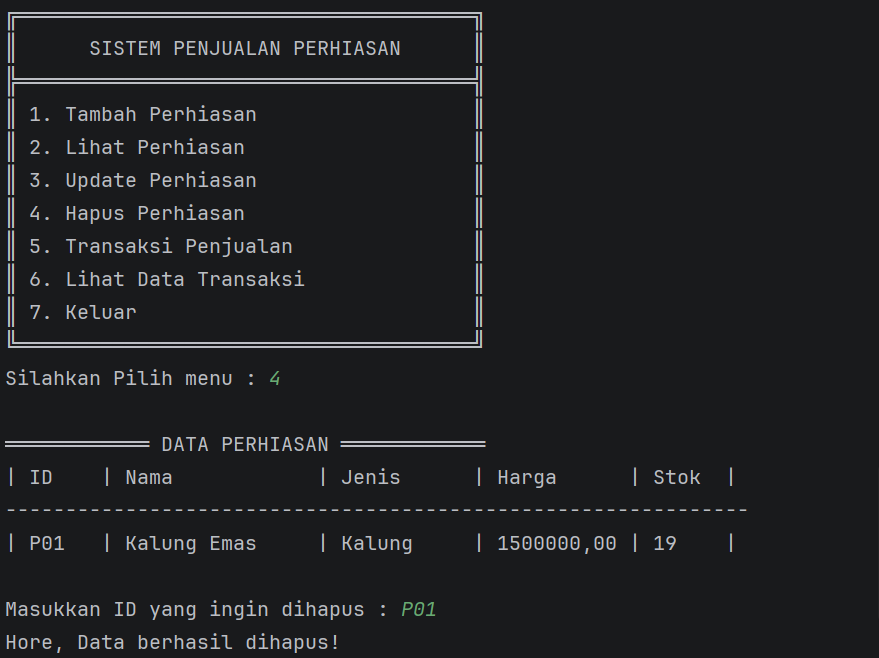
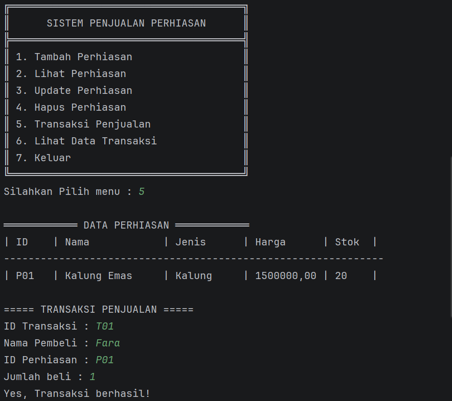
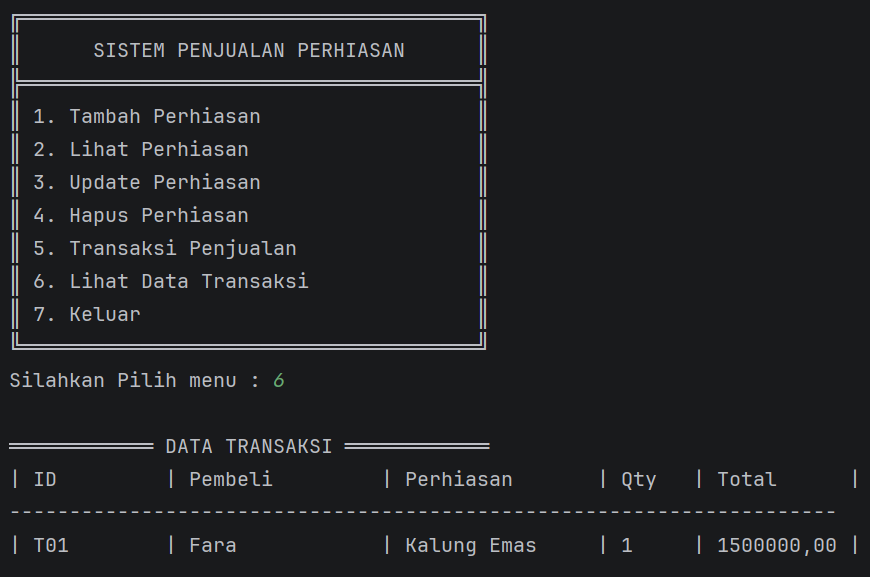

# Sistem Penjualan Perhiasan 💎

Program **Sistem Penjualan Perhiasan** merupakan program berbasis Java yang dibuat untuk mengelola data perhiasan serta melakukan transaksi penjualan. 
program dikembangkan dari posttest sebelumnya dengan menerapkan konsep **Encapsulation**.

Encapsulation digunakan untuk menyembunyikan data di dalam class agar tidak dapat diakses langsung dari luar class. Data hanya dapat diakses melalui method **getter** dan **setter**.

---

## Konsep yang Digunakan

Beberapa konsep Pemrograman Berorientasi Objek yang digunakan dalam program ini yaitu:

- Class  
- Object  
- Constructor  
- ArrayList  
- Encapsulation  
- Access Modifier  
- Getter dan Setter  

---


Penjelasan file:

- **Main.java**  
  Berisi program utama yang menampilkan menu dan menjalankan fitur program seperti menambah data, melihat data, update data, menghapus data, dan melakukan transaksi.

- **Perhiasan.java**  
  Class yang digunakan untuk menyimpan data perhiasan seperti id, nama, jenis, harga, dan stok. Pada class ini diterapkan konsep **encapsulation** dengan menggunakan atribut `private` serta method **getter** dan **setter**.

- **Transaksi.java**  
  Class yang digunakan untuk menyimpan data transaksi penjualan seperti id transaksi, nama pembeli, jumlah pembelian, dan total harga.

---

## Fitur Program

Program ini memiliki beberapa fitur utama yaitu:

1. Menambahkan data perhiasan  
2. Menampilkan data perhiasan  
3. Mengupdate data perhiasan  
4. Menghapus data perhiasan  
5. Melakukan transaksi penjualan  
6. Menampilkan data transaksi  

---

## Struktur Project

```
src
│
└── PenjualanPerhiasan
    │
    ├── Main.java
    ├── Perhiasan.java
    └── Transaksi.java
```

---


## Tampilan Program

### Menu Utama

Tampilan menu utama ketika program dijalankan.


---

### Tambah Data Perhiasan

Tampilan saat menambahkan data perhiasan.



---

### Data Perhiasan

Menampilkan seluruh data perhiasan yang tersimpan.



---

### Update Data Perhiasan

Tampilan saat mengubah data perhiasan.



---

### Hapus Data Perhiasan

Tampilan saat menghapus data perhiasan.



---

### Transaksi Penjualan

Tampilan saat melakukan transaksi penjualan.



---

### Data Transaksi

Menampilkan seluruh data transaksi yang telah dilakukan.



---


## 

Nama : Intan  
NIM : 2409106008  
Praktikum : Pemrograman Berorientasi Objek
