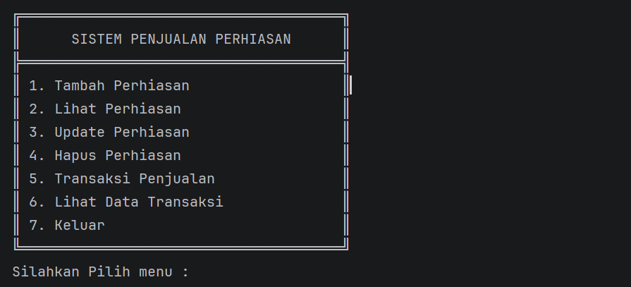
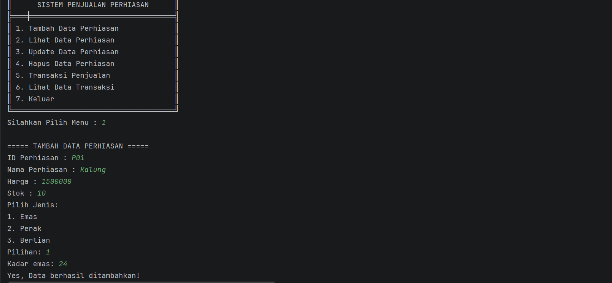
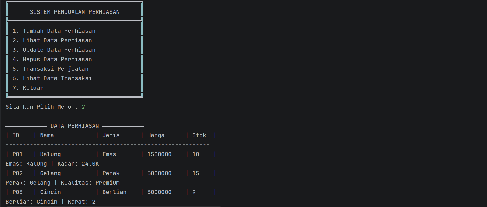
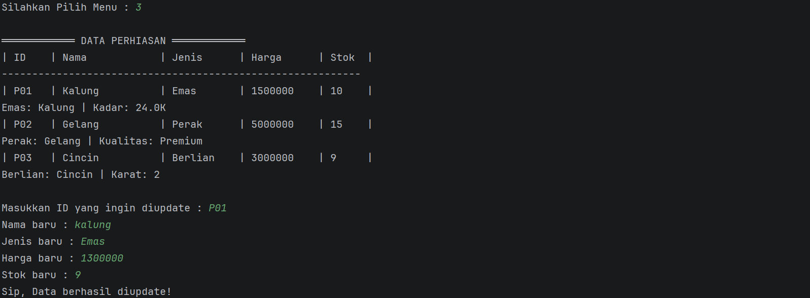
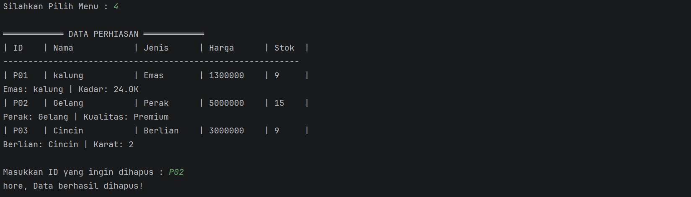
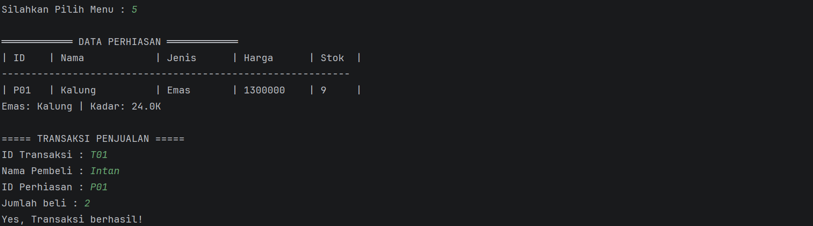
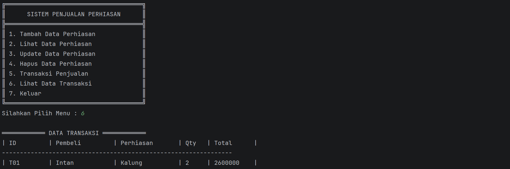

# 💎 Sistem Penjualan Perhiasan (Inheritance)

## 📌 Deskripsi Project
Project ini merupakan implementasi dari konsep **Pemrograman Berorientasi Objek (OOP)** menggunakan bahasa Java.  
Aplikasi ini digunakan untuk mengelola data perhiasan dan transaksi penjualan secara sederhana melalui terminal/console.

Pada project ini diterapkan konsep:
- Class & Object
- Encapsulation
- Inheritance (pewarisan)
- Polymorphism

## 🧩 Struktur Class

### 🔹 Superclass
- `Perhiasan`
  - Menyimpan atribut umum seperti:
    - id
    - nama
    - jenis
    - harga
    - stok

---

### 🔹 Subclass (Inheritance)
Subclass merupakan turunan dari class `Perhiasan`:

1. **Emas**
   - Atribut tambahan: `kadar`

2. **Perak**
   - Atribut tambahan: `kualitas`

3. **Berlian**
   - Atribut tambahan: `karat`

---

## 🔗 Jenis Inheritance yang Digunakan
Project ini menggunakan **Hierarchical Inheritance**, yaitu:
- Satu superclass (`Perhiasan`)
- Memiliki lebih dari satu subclass (`Emas`, `Perak`, `Berlian`)

---

## ⚙️ Fitur Program

1. Tambah Data Perhiasan  
2. Lihat Data Perhiasan  
3. Update Data Perhiasan  
4. Hapus Data Perhiasan  
5. Transaksi Penjualan  
6. Lihat Data Transaksi  

---

## Struktur Project

```
src
│
└── PenjualanPerhiasan
│
├── Main.java
├── Perhiasan.java (Superclass)
├── Transaksi.java
├── Emas.java (Subclass)
├── Perak.java (Subclass)
└── Berlian.java (Subclass)
```

---


## Tampilan Program

### Menu Utama

Tampilan menu utama ketika program dijalankan.



---

### Tambah Data Perhiasan

Tampilan saat menambahkan data perhiasan.



---

### Data Perhiasan

Menampilkan seluruh data perhiasan yang tersimpan.



---

### Update Data Perhiasan

Tampilan saat mengubah data perhiasan.



---

### Hapus Data Perhiasan

Tampilan saat menghapus data perhiasan.



---

### Transaksi Penjualan

Tampilan saat melakukan transaksi penjualan.



---

### Data Transaksi

Menampilkan seluruh data transaksi yang telah dilakukan.



---

---
## 🔄 Konsep Inheritance

Inheritance diterapkan dengan keyword:

java
extends

##
Nama : Intan  
NIM : 2409106008  
Praktikum : Pemrograman Berorientasi Objek

