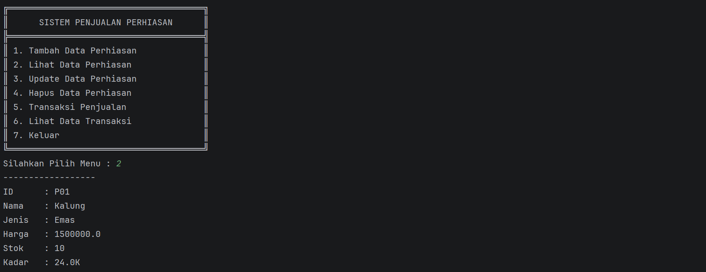
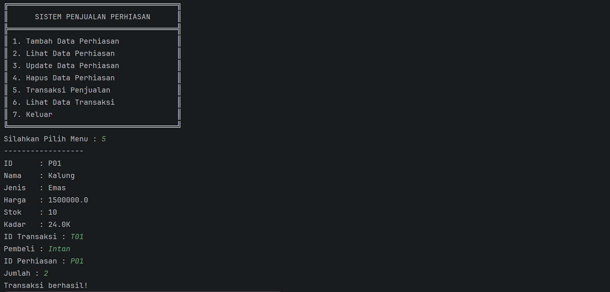
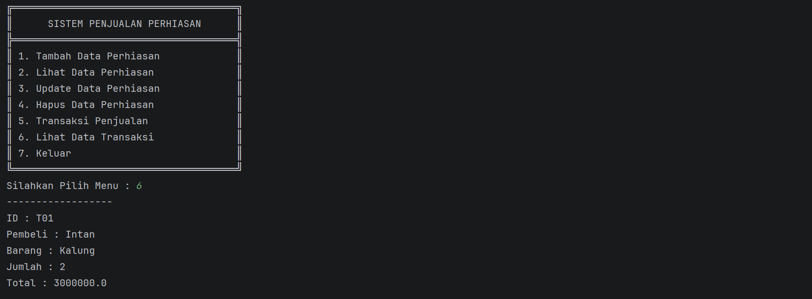

# ── ⋆⋅☆⋅⋆ Sistem Penjualan Perhiasan ⋆⋅☆⋅⋆ ──

### Posttest 5 - Praktikum Pemrograman Berorientasi Objek (PBO)

---

## Deskripsi Program

Program **Sistem Penjualan Perhiasan** merupakan aplikasi berbasis **console** yang dibuat menggunakan bahasa pemrograman **Java** dengan menerapkan konsep **Object-Oriented Programming (OOP)**.

Program ini digunakan untuk mengelola data **perhiasan dan transaksi penjualan** dengan fitur **CRUD (Create, Read, Update, Delete)**.

Pada **Posttest 5**, program ini merupakan pengembangan dari Posttest sebelumnya dengan menambahkan konsep:

 **Abstract Class**  
 **Abstract Method**  
 **Interface**

Sehingga program menjadi lebih **terstruktur, fleksibel, dan sesuai dengan konsep OOP tingkat lanjut**.

---

##  Tujuan Program

Tujuan dari pembuatan program ini adalah:

- Menerapkan konsep **Encapsulation**
- Menggunakan **Access Modifier**
- Mengimplementasikan **Getter dan Setter**
- Menerapkan konsep **Inheritance**
- Menerapkan konsep **Polymorphism**
- Menerapkan **Abstract Class dan Interface**
- Mengelola data perhiasan dan transaksi menggunakan konsep **OOP**

---

##  Konsep OOP yang Digunakan

### 🔹 Encapsulation
- Atribut pada class dibuat **private**
- Akses data menggunakan **getter**
- Perubahan data menggunakan **setter**

---

### 🔹 Inheritance
Program menggunakan hubungan **is-a**:

- `Perhiasan` → superclass (abstract)
- `Emas`, `Perak`, `Berlian` → subclass

Contoh:
```java
class Emas extends Perhiasan
````

---

### 🔹 Polymorphism

#### 1. Overriding

Method dari superclass ditulis ulang di subclass.

Contoh:

```java
@Override
public void tampilInfo()
```

Penjelasan:

* Emas → menampilkan kadar
* Perak → menampilkan kualitas
* Berlian → menampilkan karat

---

#### 2. Overloading

Method dengan nama sama tetapi parameter berbeda.

Contoh:

```java
public double hitungTotal(double harga, int jumlah)
public double hitungTotal(double harga, int jumlah, double diskon)
```

---

### 🔹 Abstract Class

Class `Perhiasan` dijadikan **abstract class**:

```java
public abstract class Perhiasan
```

Memiliki abstract method:

```java
public abstract void tampilInfo();
```

Artinya:

* Tidak bisa dibuat objek langsung
* Harus diturunkan ke subclass

---

### 🔹 Interface

Program menggunakan interface `Diskon`:

```java
public interface Diskon
```

Memiliki 2 method:

```java
double hitungDiskon(double harga, int jumlah);
double hitungTotalSetelahDiskon(double harga, int jumlah);
```

Diimplementasikan pada class:

```java
class Transaksi implements Diskon
```

---

## Penjelasan Class

### 1️ Main.java

Class utama untuk menjalankan program dan menampilkan menu.

---

### 2️ Perhiasan.java (Abstract Class)

Menyimpan data umum:

* ID
* Nama
* Jenis
* Harga
* Stok

Memiliki:

* Abstract method `tampilInfo()`

---

### 3️ Emas.java (Subclass)

Menambahkan:

* Kadar emas

Menerapkan:

* Inheritance
* Overriding

---

### 4️ Perak.java (Subclass)

Menambahkan:

* Kualitas perak

Menerapkan:

* Inheritance
* Overriding

---

### 5️ Berlian.java (Subclass)

Menambahkan:

* Karat berlian

Menerapkan:

* Inheritance
* Overriding

---

### 6️ Transaksi.java

Menyimpan:

* ID transaksi
* Nama pembeli
* Nama perhiasan
* Jumlah
* Total

Menerapkan:

* Interface (Diskon)
* Overloading

---

### 7️ Diskon.java (Interface)

Berisi:

* Method perhitungan diskon
* Method total setelah diskon

---

## Tipe Inheritance

Program menggunakan:

👉 **Hierarchical Inheritance**

Satu superclass (`Perhiasan`) memiliki banyak subclass:

* Emas
* Perak
* Berlian

---

## Fitur Program

Program memiliki **7 fitur utama**:

1. Tambah Data Perhiasan
2. Lihat Data Perhiasan
3. Update Data Perhiasan
4. Hapus Data Perhiasan
5. Transaksi Penjualan
6. Lihat Data Transaksi
7. Keluar Program

---

##  Tampilan Program


### 💎 Lihat Data Perhiasan



Penjelasan:
Menampilkan data perhiasan.

👉 Membuktikan **Overriding (Polymorphism)** karena setiap jenis menampilkan informasi berbeda.

---

### 💰 Transaksi Penjualan



Penjelasan:
Melakukan pembelian perhiasan.

👉 Menggunakan method dari **interface (Diskon)**

---

### 📊 Lihat Data Transaksi



Penjelasan:
Menampilkan data transaksi yang sudah dilakukan.

---

## 📌 Penjelasan Tambahan

Walaupun tidak semua fitur ditampilkan dalam screenshot, fitur berikut tetap berjalan:

* Tambah data
* Update data
* Hapus data

---

## 📌 Perkembangan Program

### Posttest 3:

* Inheritance

### Posttest 4:

* Polymorphism (Overloading & Overriding)

### Posttest 5:

* Abstract Class
* Abstract Method
* Interface

---

## 

Nama : Intan Alfara Audia
NIM : (2409106008)
Kelas : (A1'24)

---
